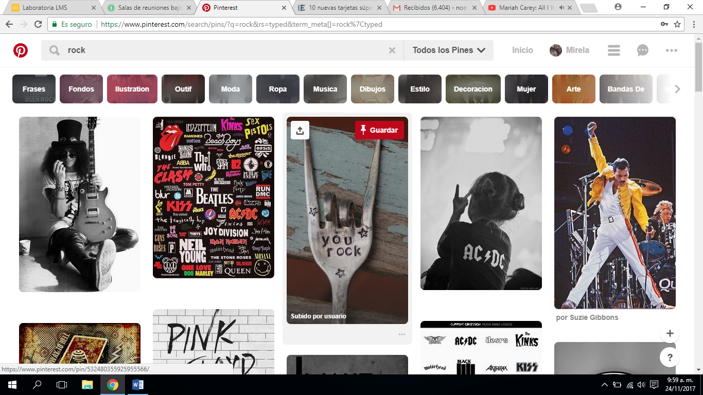

  PINTEREST

                      # UX
BARRAS   DE NAVEGACION GLOBAL

*	Barra de búsqueda
*	Perfil
*	Menú
*	Mensajería con   referencia de pines encontrados por otros usuarios.
*	Notificaciones.
*	Bandeja de entrega
*	Botón   de ayuda al usuario:
*	configuración
  -	seguridad
  -	términos y privacidad

MENU CONTEXTUAL
*	Luego de indicar en el buscador el tema de búsqueda aparece un menú con varias opciones en referencia a la referencia ingresada.

NAVEGANDO EN LAS IMAGENES
*	Botón para compartir el archivo elegido, por medio de la red social elegida.
*	Pin para guardar en nuestro historial la referencia elegida
*	Al ingresar a la imagen:
 -	referencia a información de imagen
 -	Referencia a la página original
 -	Navegación Contextual: sugerencias de imágenes relacionadas.
*	 Botones para agregar imágenes que se desee guardar   desde la web
*	Botón de asistencia para resolver dudar y contactarse con algún experto Pinterest.

                       # UI

*	Bordes redondeados. En sus contenedores.
*	Colores de sus contenedores amigables y por contexto de búsqueda.
*	Color de sus elementos de navegación (gris) para que el realce lo tenga el contenido.
*	Pin de guardar: rojo para que sea visible y llame la atención del usuario, con icono representativo.
*	Icono representativo para el botón de referenciar imagen a otros usuarios,
*	Backround blanco, para   no quitar el foco a las imágenes.
*	Deslizamiento del   menú contextual de derecha a izquierda, con botones de   flecha.
*	Hover en imágenes/ activando los botones de guardar, de enviar, y pagina web de referencia.
*	Cambio de imagen en el cursor (en búsqueda y sobre imagen.
*	Espaciado entre imágenes.

